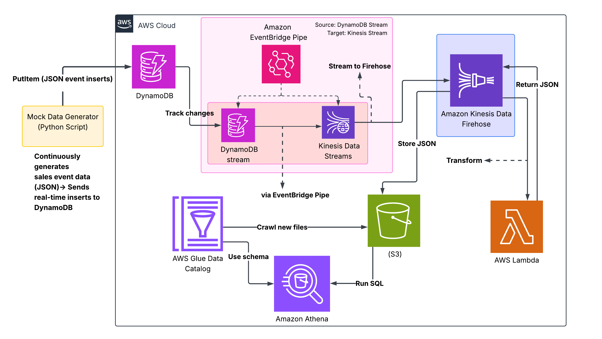

# 🌟 Project: Real-Time Data Streaming & CDC Pipeline with AWS

## 📅 Overview

This project demonstrates a **real-time data streaming pipeline** using AWS services to capture, transform, and analyze sales events in real time. It also showcases **Change Data Capture (CDC)** using DynamoDB Streams, and how modern serverless AWS components work together to build an **event-driven architecture**.

The core objective is to:

- ✅ Capture live sales data from a mock generator
- ✅ Stream it in real-time using **DynamoDB Streams** and **Amazon EventBridge Pipes**
- ✅ Transform data using **AWS Lambda** and **Kinesis Firehose**
- ✅ Store in **S3** and catalog using **AWS Glue**
- ✅ Query real-time data with **Amazon Athena**

---

## 🏛️ Architecture Diagram



---

## 🧳 Use Case Summary

- **Real-time analytics**: Process and analyze data as it's generated.
- **Change Data Capture (CDC)**: Automatically track and stream changes from a DynamoDB table.
- **Serverless architecture**: No infrastructure to manage, all AWS managed services.
- **Scalable and event-driven**: Suitable for high-volume, near real-time pipelines.

---

## 🪀 Workflow Breakdown

### 1. 🔹 Data Generation

- A Python script continuously generates **mock sales event data** in JSON format.
- Each record is pushed to **Amazon DynamoDB** using the `PutItem` API.

### 2. 🔹 Change Detection via DynamoDB Stream

- DynamoDB Streams is enabled on the table to capture **INSERT** operations.
- These changes represent our CDC layer.

### 3. 🔹 Event Routing using EventBridge Pipe

- **Amazon EventBridge Pipe** connects:

  - **Source:** DynamoDB Stream
  - **Target:** Kinesis Data Stream

- This allows **streaming inserts** to flow to downstream processors.

### 4. 🔹 Kinesis Stream + Firehose Delivery

- The **Kinesis Stream** buffers records.
- The **Kinesis Firehose** reads these records in real-time and:

  - Invokes **AWS Lambda** to transform or enrich data
  - Receives transformed data and stores it in **Amazon S3** (partitioned JSON)

### 5. 🔹 Cataloging with AWS Glue

- A Glue Crawler scans the S3 bucket periodically to:

  - Infer schema
  - Create/Update a **Glue Data Catalog table**

### 6. 🔹 Querying with Amazon Athena

- Athena queries the cataloged table directly from **S3**.
- This allows SQL queries on **near real-time data** — just seconds after ingestion.

---

## 🌍 Technologies Used

| AWS Service                    | Purpose                                 |
| ------------------------------ | --------------------------------------- |
| **DynamoDB**                   | Source database for streaming data      |
| **DynamoDB Streams**           | Captures changes to the table (CDC)     |
| **Amazon EventBridge Pipe**    | Connects Stream to Kinesis without code |
| **Amazon Kinesis Data Stream** | Real-time buffer for events             |
| **Amazon Kinesis Firehose**    | Delivery + Lambda transform integration |
| **AWS Lambda**                 | In-line transformation of records       |
| **Amazon S3**                  | Storage for partitioned JSON data       |
| **AWS Glue Crawler & Catalog** | Schema inference and table creation     |
| **Amazon Athena**              | SQL engine to query S3 data directly    |

---

## 💡 Key Learnings

- How to design a real-time, event-driven pipeline using **managed AWS services**
- How to implement **CDC with DynamoDB Streams**
- How to **transform streaming data in-flight** with Lambda
- How to **query real-time JSON data** from S3 with Athena
- How Glue makes schema management easy and automatic

---

## 🎨 Sample Athena Query

```sql
SELECT *
FROM p1_kinesis_firehose_destination
WHERE product_name = 'Laptop'
  AND creation_datetime >= current_date - interval '1' day;
```

---

## 🔧 Future Enhancements

- Add alerting (e.g., SNS) for high-value transactions
- Implement update/delete CDC logic with proper record versioning
- Visualize data using Amazon QuickSight

---

## 🚀 Final Thoughts

This project showcases the power of AWS's real-time and serverless ecosystem. With minimal operational overhead, we've built a fully functional pipeline that mimics a real-world, high-throughput analytics system, powered by CDC and ready for scalable enterprise use.
